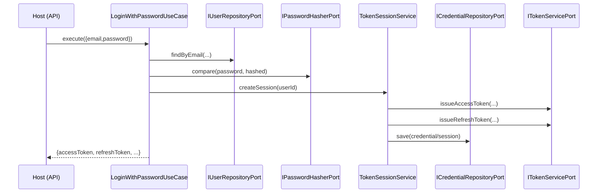
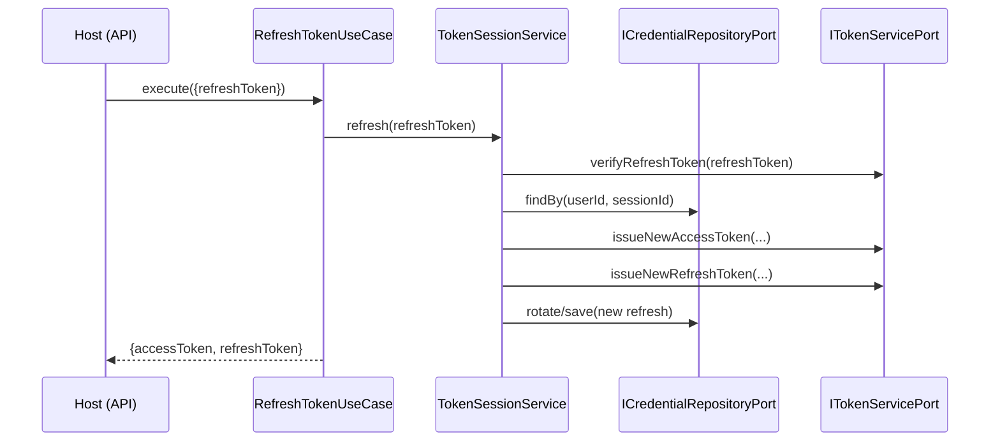
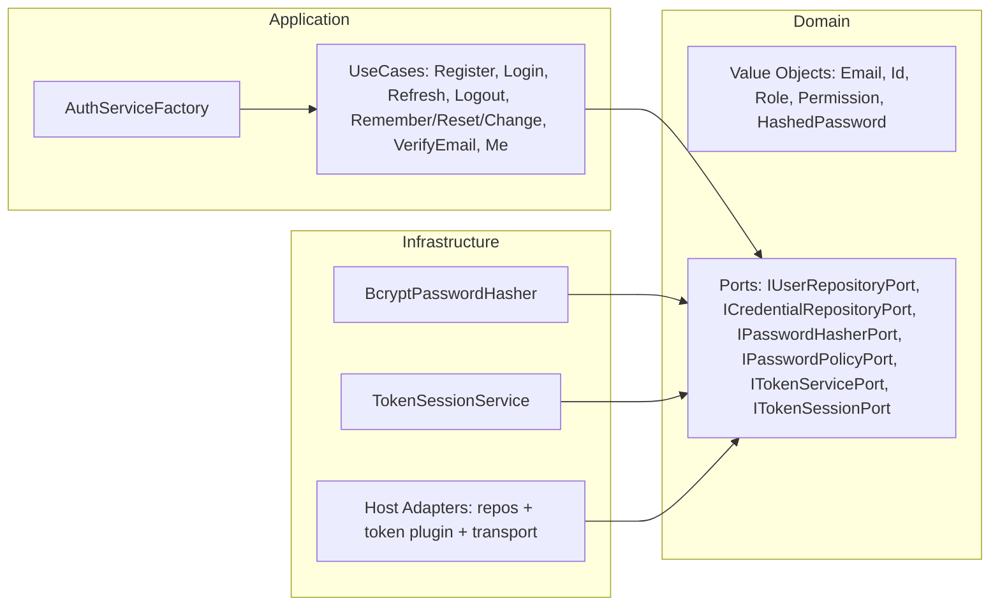

# @jmlq/auth — Architecture 🏛️

## 🎯 Objective

Describe the internal architecture of the `@jmlq/auth` core and its real mapping to Clean Architecture.

## ⭐ Importance

- Keeps domain rules stable and independent from transport.
- Allows swapping infrastructure (ORM/JWT/HTTP) without modifying use cases.
- Reduces duplicated wiring thanks to the main factory.

## 🧱 Main components (what the package exposes)

### Main factory

- `AuthServiceFactory.create(...)` builds a container with services/use cases.

Real signature (summary):

```ts
AuthServiceFactory.create(
  userRepository,
  credentialRepository,
  tokenService,
  passwordResetToken,
  emailVerificationToken,
  options?,
): IAuthServiceContainer
```

### Use cases (application)

The container returns, among others:

- `registerUserUseCase`
- `loginWithPasswordUseCase`
- `refreshTokenUseCase`
- `logoutUseCase`
- `requestPasswordResetUseCase`
- `resetPasswordUseCase`
- `changePasswordUseCase`
- `verifyEmailUseCase`
- `meUseCase`

### Services / infrastructure

- `TokenSessionService` (refresh rotation/revocation)
- `BcryptPasswordHasher` (hash/compare)
- `DefaultPasswordPolicy` (if the host does not inject another one)

## 🔁 Flows (diagrams)

### Flow: Login with password



### Flow: Refresh (rotation)



## 🧩 Clean Architecture (real mapping)



## ✅ Checklist

- [ ] Implement ports in the host (repositories + token service + reset/verify tokens)
- [ ] Build the container with `AuthServiceFactory.create(...)`
- [ ] Integrate transport (Express): request validations + cookies/headers + error mapping

## ⬅️ Previous

- [`home`](../../README.md)

## ➡️ Next

- [Configuration](./configuration.md)
- [Express Integration](./integration-express.md)
- [Troubleshooting](./troubleshooting.md)
