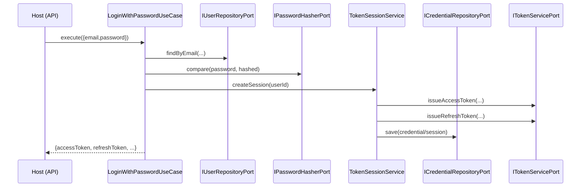
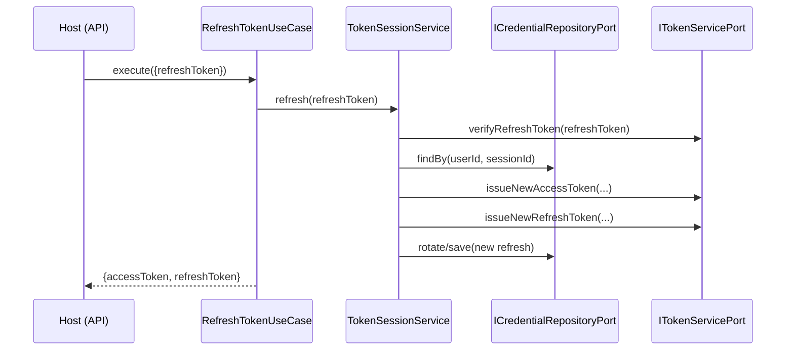
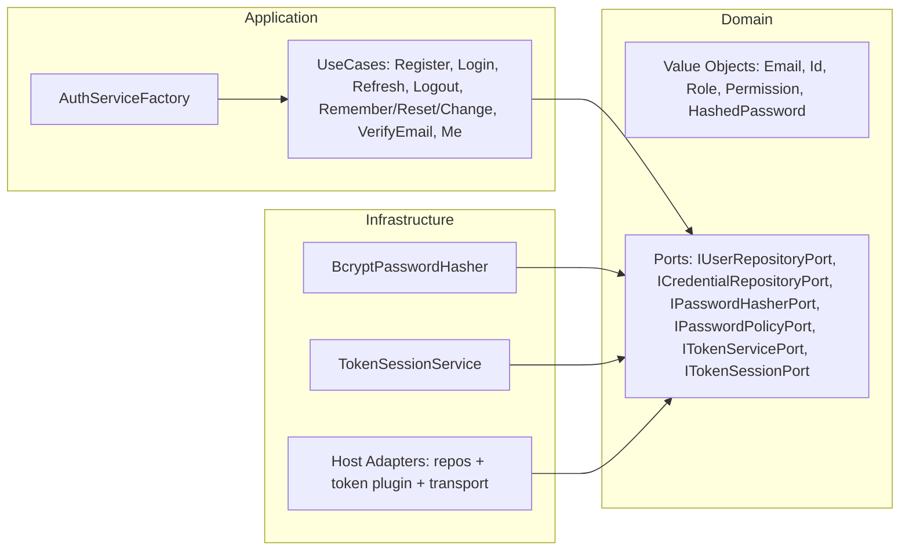

# @jmlq/auth — Architecture 🏛️

## 🎯 Objetivo

Describir la arquitectura interna del core `@jmlq/auth` y su mapeo real a Clean Architecture.

## ⭐ Importancia

- Mantiene reglas de dominio estables e independientes del transporte.
- Permite intercambiar infraestructura (ORM/JWT/HTTP) sin tocar casos de uso.
- Reduce wiring duplicado gracias a la factory principal.

## 🧱 Componentes principales (lo que expone el paquete)

### Factory principal

- `AuthServiceFactory.create(...)` construye un contenedor con servicios/casos de uso.

Firma real (resumen):

```ts
AuthServiceFactory.create(
  userRepository,
  credentialRepository,
  tokenService,
  passwordResetToken,
  emailVerificationToken,
  options?,
): IAuthServiceContainer
```

### Casos de uso (application)

El contenedor devuelve, entre otros:

- `registerUserUseCase`
- `loginWithPasswordUseCase`
- `refreshTokenUseCase`
- `logoutUseCase`
- `requestPasswordResetUseCase`
- `resetPasswordUseCase`
- `changePasswordUseCase`
- `verifyEmailUseCase`
- `meUseCase`

### Servicios/infra

- `TokenSessionService` (rotación/revocación de refresh)
- `BcryptPasswordHasher` (hash/compare)
- `DefaultPasswordPolicy` (si el host no inyecta otra)

## 🔁 Flujos (diagramas)

### Flujo: Login con password



### Flujo: Refresh (rotación)



## 🧩 Clean Architecture (mapeo real)



## ✅ Checklist

- [ ] Implementar ports en el host (repositorios + token service + reset/verify tokens)
- [ ] Construir el contenedor con `AuthServiceFactory.create(...)`
- [ ] Integrar transporte (Express): request validations + cookies/headers + mapping de errores

## ⬅️ Anterior

- [`inicio`](../../README.es.md)

## ➡️ Siguiente

- [Configuración](./configuration.md)
- [Integración Express](./integration-express.md)
- [Troubleshooting](./troubleshooting.md)
